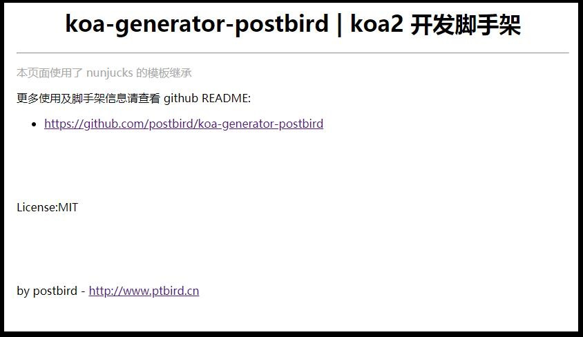

# koa-generator-postbird | koa2 开发脚手架

集成了 `koa-body` / `nunjucks` / `koa-router` / `koa-session` 的开发脚手架。

项目地址：

- github :[https://github.com/postbird/koa-generator-postbird](https://github.com/postbird/koa-generator-postbird)

- gitosc :[https://gitee.com/postbird/koa-generator-postbird](https://gitee.com/postbird/koa-generator-postbird)


## 一、基本依赖

- 路由：`koa-router`
- cookie: koa2 默认的 cookie
- session: `koa-session`
- post 请求和文件上传： `koa-body`
- 模板引擎：`nunjucks`，使用的依赖 `koa-nunjucks-2`
- 静态资源： `koa-static`

## 二、目录结构

```javascript
+ config // 配置
      |-- app.js // 应用层级配置
+ controllers // 控制器方法
+ middlewares // 中间件方法
+ models // 模型方法或数据生成
+ public 
      |-- css // stylesheet
      |-- js // scripts
      |-- vendor // 第三方依赖
      |-- upload // 文件上传路径
+ routes // 路由方法
      |-- index.js // 主路由加载
      |-- home.js // 首页路由及其他路由
+ tests // 测试方法
+ utils // 工具方法
+ views // 模板文件
      |-- base.html // 模板布局基础模板
      |-- index.html // 默认首页模板
+ app.js // 服务入口
+ nodemon.json // nodemon 配置文件
```

## 三、使用方式：

### 1、克隆项目

```bash
git clone https://github.com/postbird/koa-generator-postbird
```

### 2、安装依赖

```bash
yarn install

## npm install
```

### 3、开启服务

以开发模式运行 `app.js`, 需要全局安装 `nodemon`：

> `npm install -g nodemon`

```bash
yarn dev 

## npm run dev
```

通过 node 运行 `app.js`：

```bash
yarn start

## npm run start
```
## 四、配置文件 `config/app.js`

```javascript
/**
 * @description app的配置参数
 */
module.exports = {
  point:'3000', // 端口
  staticDir:'./public', // 静态资源配置目录
  viewsDir:'./views', // 模板文件目录
  viewsExt:'html', // 模板的后缀
  session:{
    key: 'koa:sess',   //cookie key (default is koa:sess)
    maxAge: 86400000,  // cookie的过期时间 maxAge in ms (default is 1 days)
    overwrite: true,  //是否可以overwrite    (默认default true)
    httpOnly: true, //cookie是否只有服务器端可以访问 httpOnly or not (default true)
    signed: true,   //签名默认true
    rolling: false,  //在每次请求时强行设置cookie，这将重置cookie过期时间（默认：false）
    renew: false,  //(boolean) renew session when session is nearly expired,
  },
  upload:{
    size:2*2014*1024, // 文件上传大小
    dir:"public/upload" // 文件上传路径
  }
};
```

## 五、文件上传

使用 `koa-body` 进行文件上传，基本采用默认配置，如果需要自定义文件名请参照：

- [koa2 使用 koa-body 代替 koa-bodyparser 和 koa-multer](http://www.ptbird.cn/koa-body.html)

- [koa-body 文件上传自定义文件夹及文件名称](http://www.ptbird.cn/koa-body-diy-upload-dir-and-filename.html)


## 六、效果



## License 

MIT


